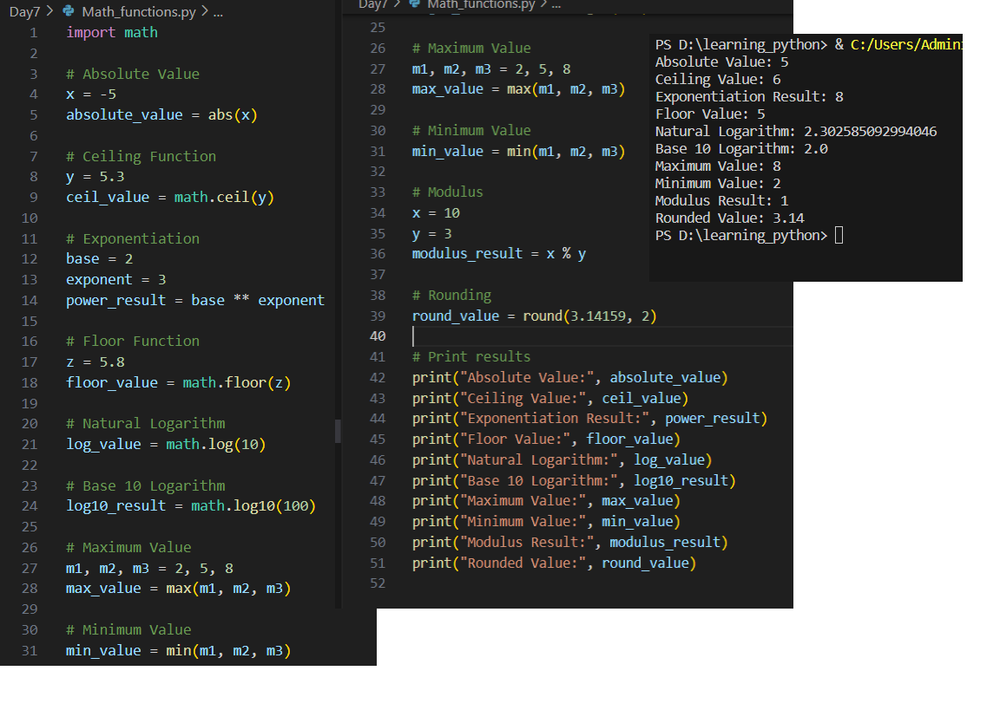
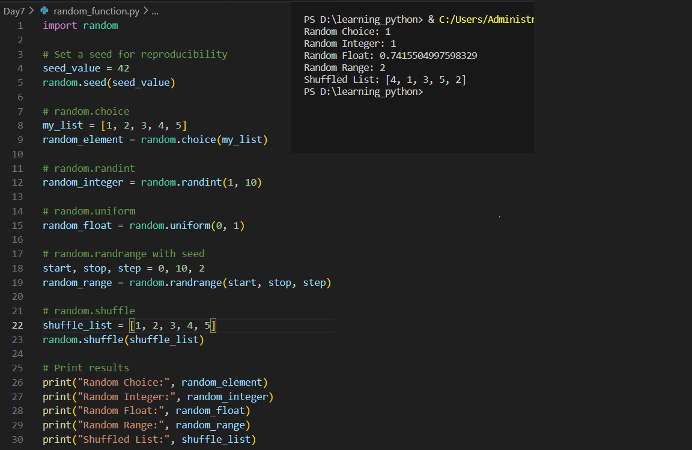
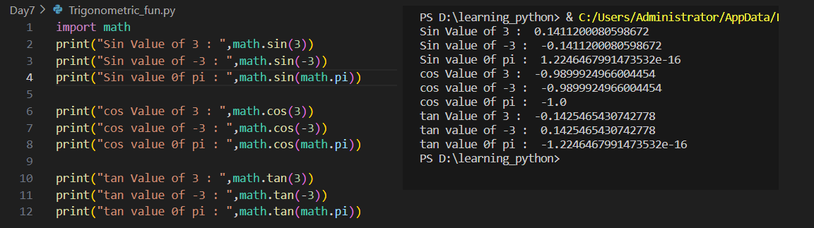

# Python Learning - Day 7 Progress

## Today's Focus: Mathematical Functions and Random Module

### Mathematical Functions with `math` Module:

1. **Absolute Value:**
   - Explored the `abs()` function to find the absolute value of a number.

2. **Ceiling Function:**
   - Utilized `math.ceil()` to round a floating-point number to the nearest integer greater than or equal to it.

3. **Exponentiation:**
   - Calculated the result of raising a base to an exponent using the exponentiation operator (`**`).

4. **Floor Function:**
   - Applied `math.floor()` to round a floating-point number to the nearest integer less than or equal to it.

5. **Natural Logarithm:**
   - Used `math.log()` to find the natural logarithm of a number.

6. **Base 10 Logarithm:**
   - Explored `math.log10()` to find the logarithm of a number to the base 10.

7. **Maximum and Minimum Values:**
   - Utilized `max()` and `min()` functions to find the maximum and minimum values among a set of numbers.

8. **Modulus:**
   - Applied the modulus operator (`%`) to find the remainder of a division operation.

9. **Rounding:**
   - Employed `round()` function to round a floating-point number to a specified number of decimal places.

### Random Module:

10. **Seed for Reproducibility:**
    - Set a seed using `random.seed()` for reproducibility in random number generation.

11. **Random Choice:**
    - Utilized `random.choice()` to randomly select an element from a list.

12. **Random Integer:**
    - Generated a random integer within a specified range using `random.randint()`.

13. **Random Float:**
    - Generated a random floating-point number within a specified range using `random.uniform()`.

14. **Random Range with Seed:**
    - Used `random.randrange()` to generate a random number within a specified range with a given step.

15. **Shuffling a List:**
    - Employed `random.shuffle()` to randomly shuffle the elements of a list.

### Trigonometric Functions with `math` Module:

16. **Sine, Cosine, and Tangent:**
    - Calculated the sine, cosine, and tangent values using `math.sin()`, `math.cos()`, and `math.tan()`.

17. **Trigonometric Inverse Functions:**
    - Explored `math.asin()`, `math.acos()`, and `math.atan()` for finding angles based on trigonometric ratios.

18. **Hyperbolic Functions:**
    - Learned about hyperbolic functions using `math.sinh()`, `math.cosh()`, and `math.tanh()`.

19. **Mathematical Constants:**
    - Utilized mathematical constants like `math.pi` and `math.e` in various calculations.

