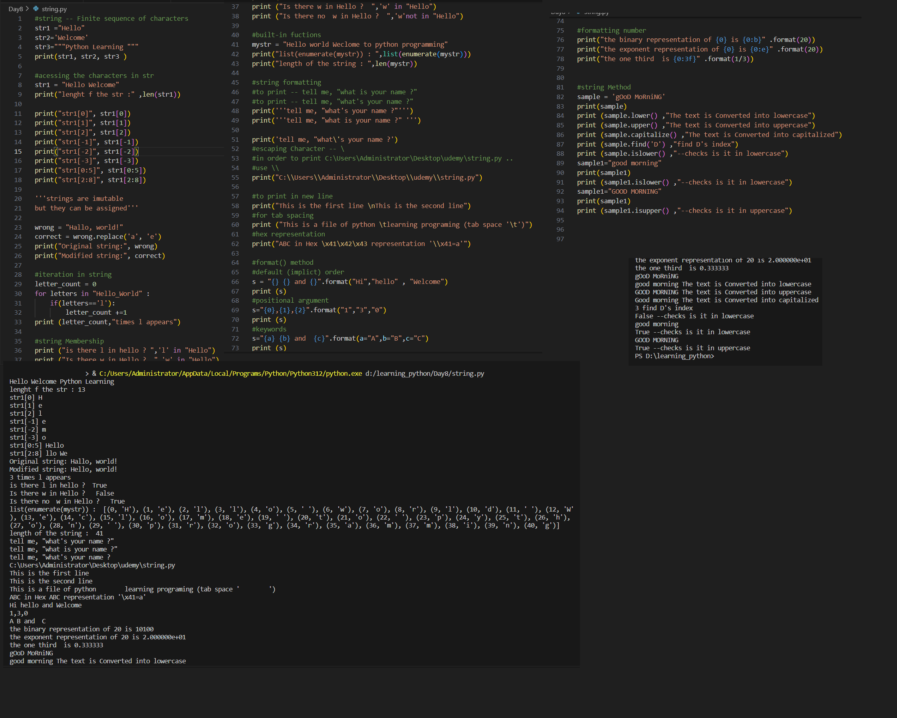

# Python Learning - Day 8 Progress

## Today's Focus: Strings in Python

### Basics of Strings:

1. **String Definition:**
   - A string is a finite sequence of characters.
   - Explored various ways to define strings using single, double, and triple quotes.

2. **Accessing Characters:**
   - Determined the length of a string using the `len()` function.
   - Accessed individual characters using indexing and slicing.

3. **String Immutability:**
   - Noted that strings are immutable, but they can be reassigned using methods like `replace()`.

### String Manipulation and Iteration:

4. **Replacing Characters:**
   - Demonstrated the use of the `replace()` method to modify strings.

5. **Iteration in Strings:**
   - Used a `for` loop to iterate through characters in a string.
   - Counted occurrences of a specific letter (e.g., 'l').

6. **String Membership:**
   - Checked if a letter is present in a string using the `in` and `not in` operators.

### Built-in Functions and Formatting:

7. **Built-in Functions:**
   - Used `len()` to find the length of a string.
   - Explored the `enumerate()` function to get index-value pairs.

8. **String Formatting:**
   - Applied string formatting using different methods, including explicit and implicit order.
   - Used positional arguments and keyword arguments in the `format()` method.

9. **Special Characters and Escape Sequences:**
   - Explored escape characters like `\n` for a new line and `\t` for tab spacing.
   - Utilized hex representation and escaping characters (e.g., `\\`).

### Format() Method and Number Formatting:

10. **Format() Method:**
    - Demonstrated the use of the `format()` method for string formatting.

11. **Formatting Numbers:**
    - Formatted numbers with binary representation, exponent representation, and fixed decimal places.

### String Methods:

12. **String Methods:**
    - Explored various string methods like `lower()`, `upper()`, `capitalize()`, `find()`, `islower()`, and `isupper()`.

