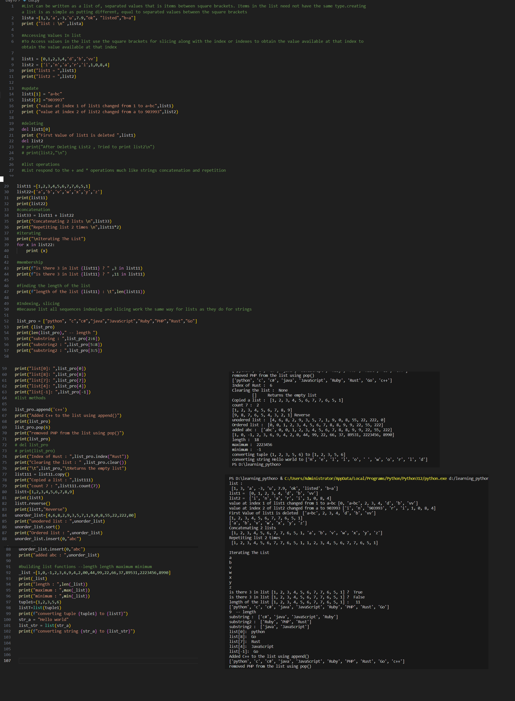

# Python Learning - Day 10 Progress

## Today's Focus: Lists in Python

### Introduction to Lists:

1. **List Definition:**
   - Lists can be written as a sequence of comma-separated values enclosed in square brackets.
   - Created a sample list with various data types.

2. **Accessing Values in a List:**
   - Demonstrated how to access values in a list using indexing and slicing.
   - Illustrated updating values in a list.

3. **Deleting Elements from a List:**
   - Used the `del` keyword to delete elements from a list.

### List Operations:

4. **List Operations:**
   - Showed how lists respond to concatenation (`+`) and repetition (`*`).

5. **Iterating Through a List:**
   - Used a `for` loop to iterate through the elements of a list.

6. **Membership Check:**
   - Checked if an element is present in a list using the `in` operator.

7. **Finding the Length of a List:**
   - Used the `len()` function to find the length of a list.

### Indexing and Slicing:

8. **Indexing and Slicing:**
   - Demonstrated indexing and slicing on lists, similar to strings.

### List Methods:

9. **Common List Methods:**
   - Used methods like `append()`, `pop()`, and `index()` on lists.
   - Showed how to clear a list using `clear()`.

10. **List Manipulation:**
    - Copied a list using the `copy()` method.
    - Counted occurrences of an element using `count()`.

11. **List Sorting and Reversing:**
    - Sorted and reversed lists using `sort()` and `reverse()`.

### Building List Functions:

12. **Building List Functions:**
    - Explored functions like `len()`, `max()`, and `min()` on lists.
    - Converted a tuple and a string into lists.

