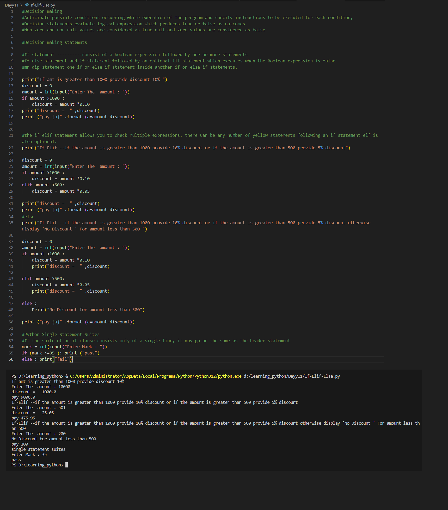

# Python Learning - Day 11 Progress

## Today's Focus: Decision Making Statements

### Introduction to Decision Making:

1. **Anticipating Conditions:**
   - Anticipated possible conditions occurring during the execution of the program.
   - Specified instructions for each condition using decision-making statements.

2. **Decision Statements:**
   - Decision statements evaluate logical expressions that produce true or false outcomes.
   - Non-zero and non-null values are considered as true, while null and zero values are considered as false.

### Decision Making Statements:

3. **If Statement:**
   - Explored the `if` statement, consisting of a boolean expression followed by one or more statements.
   - Used an example to provide a discount if the amount is greater than 1000.

4. **If-Else Statement:**
   - Introduced the `if-else` statement, where the `else` statement executes when the boolean expression in `if` is false.
   - Provided an example of applying different discounts based on the amount.

5. **If-Elif-Else Statement:**
   - Utilized the `if-elif-else` statement to check multiple expressions.
   - Illustrated providing different discounts based on various conditions.
   

6. **Single Statement Suites:**
   - Demonstrated the use of single statement suites with the `if` and `else` statements.
   - If the suite of an `if` clause consists only of a single line, it may go on the same line as the header statement.

### Examples:

7. **Example - Discount Calculation:**
   - Created a program that calculates discounts based on user input for the amount.

8. **Example - Pass/Fail Decision:**
   - Implemented a pass/fail decision based on the user's input for the mark.

