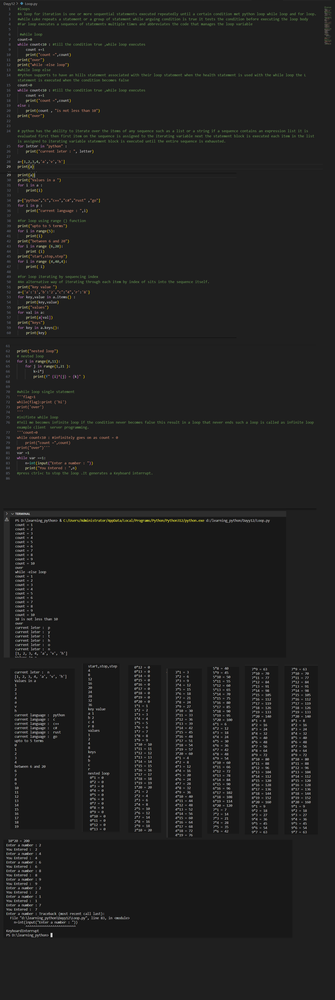

# Python Learning - Day 12 Progress

## Today's Focus: Loops in Python

### Introduction to Loops:

1. **Iteration in Python:**
   - Discussed the concept of iteration, where one or more sequential statements are executed repeatedly until a certain condition is met.

2. **While Loop:**
   - Introduced the `while` loop, which repeats a statement or a group of statements while a certain condition is true.
   - Demonstrated a simple `while` loop.

3. **While-Else Loop:**
   - Explored the `while-else` loop, where the `else` statement is executed when the `while` loop condition becomes false.

4. **For Loop:**
   - Covered the `for` loop, which iterates over the items of any sequence (e.g., list, string).
   - Illustrated examples of using `for` loops with strings and lists.

5. **For Loop with Range Function:**
   - Used the `range()` function with `for` loops to iterate over a specified range of values.

6. **For Loop with Sequencing Index:**
   - Demonstrated an alternative way of iterating through each item by index of the sequence itself.

7. **Nested Loops:**
   - Explored the concept of nested loops, where one loop is present inside another.
   - Illustrated an example of a nested loop.

8. **Infinite While Loop:**
   - Discussed the possibility of creating an infinite loop with a `while` statement.
   - Cautioned about avoiding infinite loops and how to break them.

### Examples:

9. **Example - Multiplication Table:**
   - Created a program using nested loops to generate a multiplication table.

10. **Example - Infinite While Loop:**
    - Illustrated the concept of an infinite loop and how to stop it.

