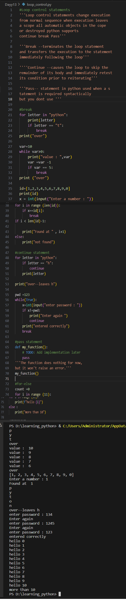

# Python Learning - Day 13 Progress

## Today's Focus: Loop Control Statements

### Introduction to Loop Control Statements:

1. **Loop Control Statements in Python:**
   - Discussed loop control statements that change the execution from the normal sequence.

2. **Break Statement:**
   - Explored the `break` statement, which terminates the loop statement and transfers the execution to the statement immediately following the loop.
   - Illustrated examples of using `break` in `for` and `while` loops.

3. **Continue Statement:**
   - Covered the `continue` statement, which causes the loop to skip the remainder of its body and immediately retest its condition prior to reiterating.
   - Demonstrated examples of using `continue` in `for` loops.

4. **Pass Statement:**
   - Introduced the `pass` statement in Python, used when a statement is required syntactically but you don't want to add any code.
   - Provided an example of using `pass` in a function.

5. **For-Else Loop:**
   - Explored the `for-else` loop, where the `else` statement is executed when the loop has exhausted iterating through the iterable.
   - Demonstrated an example of using `for-else`.

### Examples:

6. **Example - Breaking a Loop:**
   - Created examples using the `break` statement to terminate loops based on certain conditions.

7. **Example - Continuing a Loop:**
   - Illustrated the use of the `continue` statement to skip iterations within a loop.

8. **Example - Pass Statement:**
   - Showed how the `pass` statement can be used as a placeholder in functions.

9. **Example - For-Else Loop:**
   - Demonstrated the `for-else` loop and when the `else` statement is executed.

