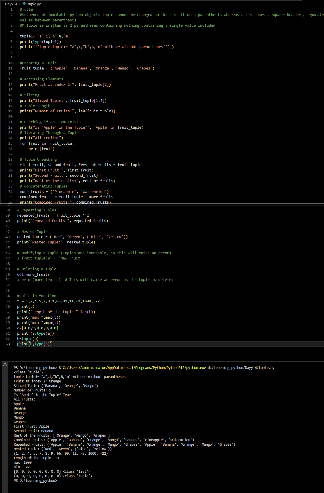

# Python Learning - Day 14 Progress

## Today's Focus: Tuples in Python

### Introduction to Tuples:

1. **Tuple in Python:**
   - Introduced the concept of a tuple, which is a sequence of immutable Python objects.
   - Compared tuples to lists, emphasizing the immutability of tuples.

2. **Creating and Accessing Tuples:**
   - Created tuples using parentheses and explored different ways to access elements.
   - Demonstrated slicing, tuple length, checking existence, and iterating through a tuple.

3. **Tuple Unpacking:**
   - Unpacked tuples to assign values to multiple variables simultaneously.

4. **Tuple Operations:**
   - Concatenated tuples, repeated tuples, and explored nested tuples.

5. **Modifying and Deleting Tuples:**
   - Discussed the immutability of tuples, highlighting that tuples cannot be modified once created.
   - Showed how to delete a tuple using the `del` statement.

6. **Built-in Functions for Tuples:**
   - Utilized built-in functions such as `len()`, `max()`, and `min()` on tuples.

### Examples:

7. **Example - Creating and Manipulating Tuples:**
   - Created a tuple of fruits and performed various operations on it, demonstrating the characteristics of tuples.

8. **Example - Tuple Unpacking:**
   - Unpacked a tuple to showcase the convenient tuple unpacking feature.

