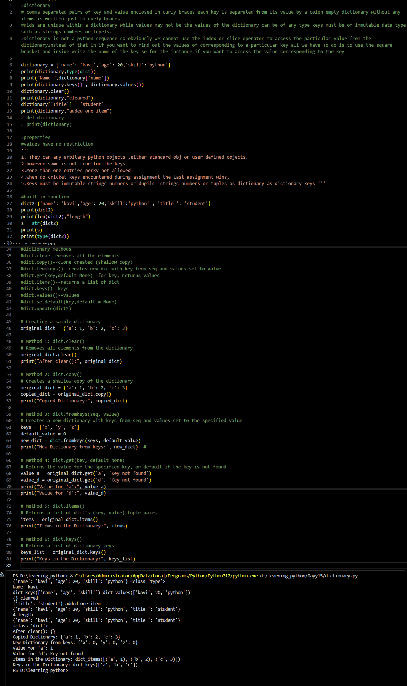

# Python Learning - Day 14 Progress

## Today's Focus: Dictionary in Python

### Introduction to Dictionary:

1. **Dictionary in Python:**
   - Explored the concept of dictionaries in Python.
   - A dictionary is a collection of comma-separated pairs of keys and values, enclosed in curly braces.

2. **Properties of Dictionary:**
   - Values in a dictionary can be of any arbitrary Python objects, either standard or user-defined.
   - More than one entry per key is not allowed.
   - When duplicate keys are encountered during assignment, the last assignment wins.
   - Keys must be immutable, such as strings, numbers, or tuples.

3. **Basic Operations and Functions:**
   - Demonstrated basic operations like accessing values using keys, clearing a dictionary, and adding new items.
   - Covered dictionary methods like `clear()`, `copy()`, `fromkeys()`, `get()`, `items()`, and `keys()`.

4. **Examples of Dictionary Usage:**
   - Provided examples showcasing dictionary methods and their applications.
   - Illustrated the use of `clear()`, `copy()`, `fromkeys()`, and others.

### Examples:

5. **Example - Clearing a Dictionary:**
   - Used `clear()` to remove all elements from a dictionary.

6. **Example - Creating a Copy:**
   - Created a shallow copy of a dictionary using `copy()`.

7. **Example - Creating a Dictionary from Keys:**
   - Used `fromkeys()` to create a new dictionary with keys from a sequence.

8. **Example - Accessing Values with Default:**
   - Utilized `get()` to retrieve values for specific keys with a default value if the key is not found.

9. **Example - Retrieving Items and Keys:**
   - Demonstrated the use of `items()` and `keys()` to get items and keys from a dictionary.

