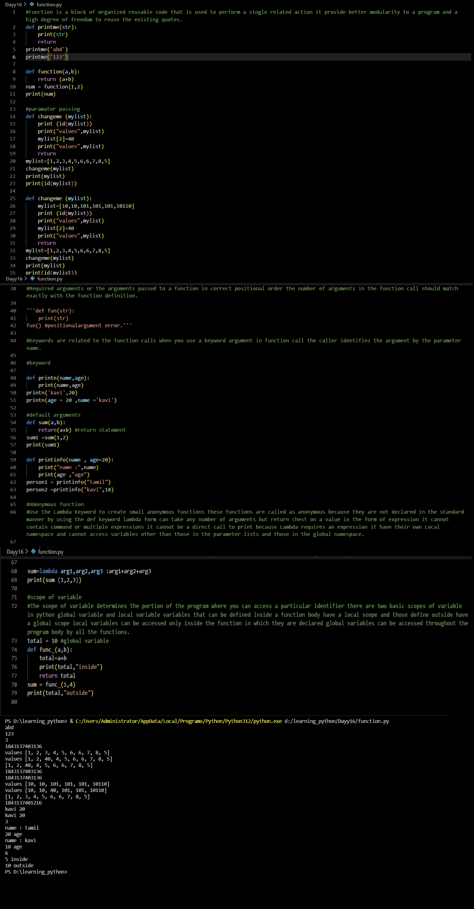

# Python Learning - Day 16 Progress

## Today's Focus: Functions in Python

### Introduction to Functions:

1. **Functions in Python:**
   - Explored the concept of functions in Python.
   - A function is a block of organized, reusable code that performs a single related action.
   - Functions provide better modularity to a program and a high degree of freedom to reuse existing code.

2. **Defining and Calling Functions:**
   - Created simple functions using the `def` keyword.
   - Demonstrated function definition, parameter passing, and return statements.
   - Illustrated the usage of functions with examples.

3. **Parameter Passing:**
   - Discussed parameter passing and how functions can modify mutable objects passed as parameters.
   - Explored examples showcasing the behavior of functions with lists as parameters.

4. **Arguments and Keywords:**
   - Covered required arguments and the importance of passing arguments in the correct positional order.
   - Introduced keyword arguments and their usage in function calls.

5. **Default Arguments:**
   - Explored default arguments in function definitions.
   - Demonstrated functions with default argument values, allowing flexibility in function calls.

6. **Anonymous Functions (Lambda):**
   - Introduced anonymous functions using the `lambda` keyword.
   - Explained the characteristics and usage of lambda functions.

7. **Scope of Variables:**
   - Discussed the scope of variables in Python, distinguishing between global and local variables.
   - Illustrated examples of variable scope within functions.

### Examples:

8. **Example - Basic Function:**
   - Created a basic function using the `def` keyword and called it with different arguments.

9. **Example - Keyword Arguments:**
   - Utilized keyword arguments in function calls to pass parameters by name.

10. **Example - Default Arguments:**
    - Demonstrated default arguments in function definitions and function calls.

11. **Example - Anonymous Functions (Lambda):**
    - Used lambda functions to create small, anonymous functions with specific expressions.

12. **Example - Variable Scope:**
    - Explored the scope of variables with examples of global and local variables.

