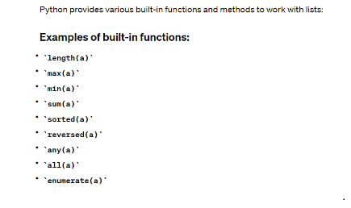
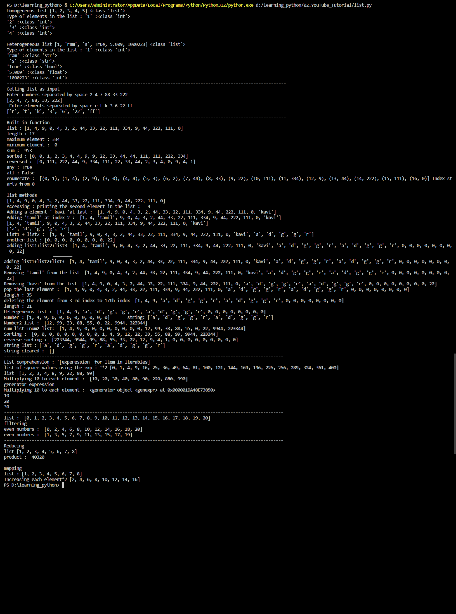

- **List Data Structure**: 
  - Understanding the concept of lists as ordered collections of elements.
  - Exploring the mutability of lists and their ability to store heterogeneous data.
  - Learning about basic operations such as creating lists, accessing elements, and using built-in functions.
  
  - Exploring various list methods for manipulation, including adding, removing, and sorting elements.
  - Implementing list comprehension for creating new lists efficiently.
  - Exploring advanced list operations such as filtering, reducing, and mapping.

 

