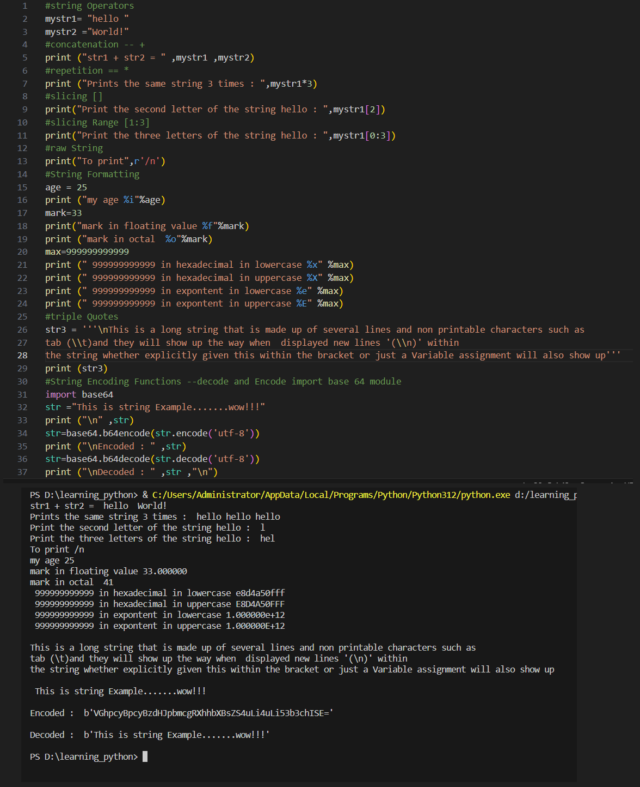

# Python Learning - Day 9 Progress

## Today's Focus: String Operators, Slicing, String Formatting, and Encoding Functions

### String Operators:

1. **Concatenation (`+`):**
   - Concatenated two strings using the `+` operator.

2. **Repetition (`*`):**
   - Demonstrated string repetition using the `*` operator.

### String Slicing:

3. **Slicing (`[]`):**
   - Accessed individual characters using indexing.
   - Utilized slicing to extract portions of a string.

### Raw String and String Formatting:

4. **Raw String:**
   - Used raw string notation (`r`) to print special characters.

5. **String Formatting:**
   - Formatted strings using placeholders and the `%` operator.
   - Demonstrated formatting with integers, floating-point numbers, octal, and hexadecimal representations.

### Triple Quotes and String Encoding Functions:

6. **Triple Quotes:**
   - Utilized triple-quoted strings for multiline text.

7. **String Encoding and Decoding:**
   - Imported the `base64` module.
   - Encoded and decoded strings using `base64.b64encode()` and `base64.b64decode()`.

