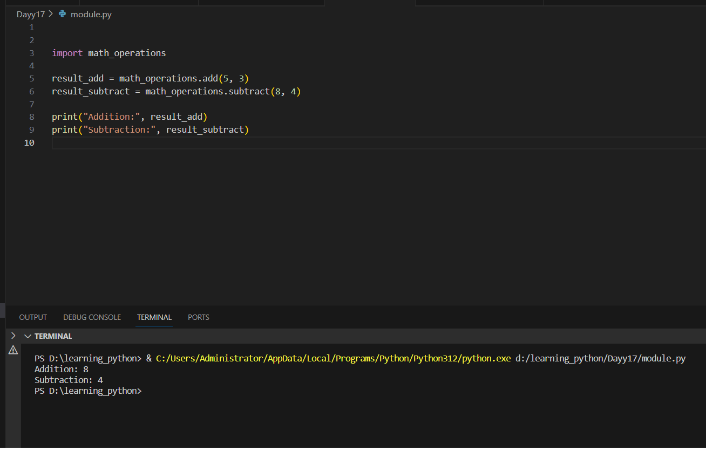

# Python Learning - Day 17 Progress

## Today's Focus: Modules, Packages, and Variable Scoping

### Explored Concepts:

1. **Modules in Python:**
   - Learned about modules as a way to organize Python code.
   - Modules are Python files containing functions, variables, and classes that can be imported into other Python scripts.

2. **Packages:**
   - Introduced the concept of packages as a way to organize related modules.
   - Packages allow hierarchical structuring of the module namespace.

3. **Variable Scoping:**
   - Discussed the scoping of variables in Python, including global and local scopes.
   - Variables defined inside functions have local scope, while those defined outside have global scope.

4. **Importing Modules:**
   - Demonstrated importing a custom module named `math_operations`.
   - Utilized functions from the imported module to perform addition and subtraction.

